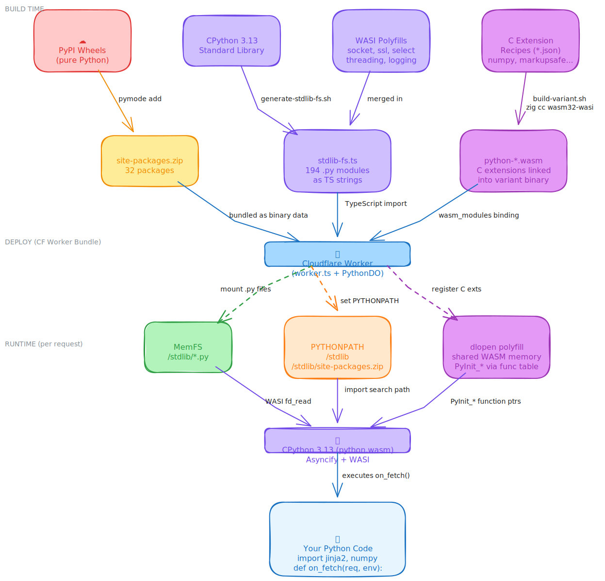
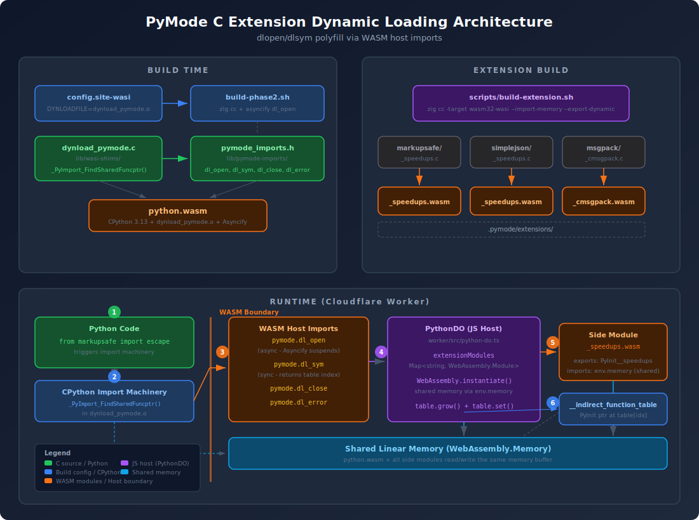

# PyMode (Experimental)

**Python on Cloudflare Workers** — write Python handlers, deploy to the edge.

> **Note:** This project is experimental and under active development. APIs and features may change.

CPython 3.13 compiled to WASM with `zig cc`. Runs on Workers with access to KV, R2, D1, TCP, and HTTP via custom host imports.

> This is a personal experiment in running upstream CPython 3.13 on Cloudflare Workers via `zig cc` → `wasm32-wasi`. Cloudflare's official [Python Workers](https://blog.cloudflare.com/python-workers) ship Pyodide and are the supported path; PyMode is not a replacement for them.

## Quick Start

```bash
# Create a new project
npx pymode init my-worker
cd my-worker

# Start local dev server (uses native Python, instant reload)
pymode dev
# → Listening on http://localhost:8787

# Deploy to Cloudflare Workers
pymode deploy
```

Your handler (`src/entry.py`):

```python
from pymode.workers import Response

def on_fetch(request, env):
    return Response("Hello from PyMode!")
```

## How It Works

You write `.py` files with an `on_fetch(request, env)` handler — same pattern as CF Python Workers. PyMode bundles your project files into the worker at deploy time and routes each request through PythonDO with full host imports via Asyncify.

```
CF Request
  → Worker serializes request to JSON
  → PythonDO runs python.wasm with Asyncify + pymode.* host imports
    → _handler.py imports your entry module
    → Calls on_fetch(request, env)
    → env.MY_KV.get("key") → _pymode.kv_get() → Asyncify suspends
      → JS awaits env.KV.get() → Asyncify resumes with result
    → Handler returns Response
  → Worker deserializes response JSON → CF Response
```

## Features

### Request Handler Pattern

```python
from pymode.workers import Response

def on_fetch(request, env):
    if request.path == "/api/data":
        data = env.MY_KV.get("key", type="json")
        return Response.json(data)

    if request.path == "/greet":
        name = request.query.get("name", ["World"])[0]
        return Response(f"Hello, {name}!")

    return Response("Not Found", status=404)
```

### CF Bindings via Host Imports

Direct access to KV, R2, D1 through WASM host imports — no serialization overhead:

```python
def on_fetch(request, env):
    # KV — auto-detected from naming convention (*_KV or KV)
    value = env.MY_KV.get("key")
    env.MY_KV.put("key", "value")

    # R2
    data = env.MY_R2.get("file.bin")
    env.MY_R2.put("file.bin", binary_data)

    # D1
    result = env.MY_DB.prepare("SELECT * FROM users WHERE id = ?").bind(42).all()

    # Environment variables / secrets
    api_key = env.API_KEY
```

Under the hood, `env.MY_KV.get("key")` calls `_pymode.kv_get()` which is a WASM host import. Asyncify suspends the WASM stack, JS awaits the real CF KV binding, then resumes Python.

### Packages

<p align="center">
  
</p>

PyMode supports three types of packages, all loaded transparently through CPython's standard import machinery:

**Pure Python packages** — install from PyPI, bundled into `site-packages.zip`:

```bash
pymode add jinja2 click beautifulsoup4
pymode install            # reinstall from pyproject.toml
```

40+ packages work out of the box including jinja2, click, beautifulsoup4, pyyaml, starlette, attrs, packaging, pyparsing, six, idna, anyio, certifi, requests, httpx, urllib3, msgpack, xxhash, regex, and more.

```python
from jinja2 import Environment
from pymode.workers import Response

def on_fetch(request, env):
    t = Environment().from_string("Hello {{ name }}!")
    return Response(t.render(name="World"))
```

**CPython stdlib** — 193 modules bundled as TypeScript string constants in `stdlib-fs.ts`, mounted into the MemFS at `/stdlib/`. Includes encodings, json, re, collections, email, http, html, importlib, unittest, and more. WASI polyfills replace unavailable C modules (socket, ssl, select, threading, logging) so stdlib modules that depend on them work correctly.

**C extension packages** — compiled to `.wasm` side modules via recipe-based builds:

```bash
# Build using a recipe (recipes/*.json)
python3 scripts/build-variant.py numpy
python3 scripts/build-extension.py markupsafe
```

At runtime, CPython's import machinery calls `dlopen`/`dlsym` as usual —
`dynload_pymode.c` intercepts these and routes them through WASM host imports.
PythonDO loads the pre-compiled `.wasm` side module with shared linear memory,
resolves `PyInit_*` via the indirect function table, and returns a function
pointer back to CPython.

```python
# Works transparently — numpy's C core is statically linked
import numpy as np
arr = np.array([1, 2, 3])
print(arr.mean())  # 2.0
```

Recipes define how to compile each C extension (`recipes/*.json`). Currently
supported: numpy, markupsafe, pyyaml, regex, multidict, yarl, frozenlist,
propcache, zstandard. Extensions must compile with `zig cc -target wasm32-wasi`.

**Native built-in extensions** — compiled directly into the WASM binary for zero-overhead access:

| Extension | Package | What it provides |
|-----------|---------|------------------|
| `_xxhash` | xxhash | Native XXH3/XXH64/XXH128 hashing |
| `_regex` | regex | Full Unicode properties, fuzzy matching |
| `_cmsgpack` | msgpack | C-speed MessagePack serialization |
| `_markupsafe_speedups` | markupsafe/jinja2 | Fast HTML escaping |

These are registered as CPython built-in modules and loaded via bridge files in site-packages. Variant builds (e.g. `python-pydantic-core.wasm`) that don't include a native extension automatically fall back to pure-Python implementations.

### Multi-File Projects

```
my-worker/
  pyproject.toml          # [tool.pymode] main = "src/entry.py"
  src/
    entry.py              # def on_fetch(request, env): ...
    routes.py             # import from other files normally
    middleware.py
    utils.py
```

All `.py` files are bundled into the VFS at deploy time. Import sibling files naturally:

```python
# src/entry.py
from helpers import greet       # sibling import (same directory)
from src.utils import validate  # absolute import (from project root)
```

### TCP Connections

Database drivers work through persistent TCP connections:

```python
from pymode.tcp import PyModeSocket as socket

sock = socket()
sock.connect(("db.example.com", 5432))
sock.send(b"SELECT 1")
data = sock.recv(4096)
```

### HTTP Fetch

```python
from pymode.http import fetch

response = fetch("https://api.example.com/data")
print(response.status, response.text)
```

### Threading via Child DOs

Real parallelism — each thread runs in its own Durable Object with a separate 30s CPU budget:

```python
from pymode.parallel import spawn, gather

task1 = spawn(process_chunk, data[:1000])
task2 = spawn(process_chunk, data[1000:])
results = gather(task1, task2)
```

### Workflows

Durable multi-step execution with retries and backoff:

```python
from pymode.workflows import Workflow

workflow = Workflow("order-processing")

@workflow.step
def validate(ctx):
    return {"valid": True, "item": ctx.input["item"]}

@workflow.step(retries=3, backoff=2.0)
def charge(ctx):
    order = ctx.results["validate"]
    return {"charged": True, "total": 29.97}

@workflow.step
def confirm(ctx):
    return {"status": "confirmed"}
```

```bash
# Run the workflow
curl -X POST http://localhost:8787/workflow/run \
  -d '{"input": {"item": "widget", "quantity": 3}}'
```

### Service Bindings (TS → Python)

Call Python functions from TypeScript workers via Durable Object RPC — no HTTP serialization:

```typescript
const doId = env.PYTHON_DO.idFromName("default");
const pythonDO = env.PYTHON_DO.get(doId);

const result = await pythonDO.callFunction(
  "src.analytics",       // Python module
  "summarize",           // Function name
  { values: [1, 2, 3] } // kwargs (JSON-serializable)
);
// result.returnValue → { count: 3, mean: 2.0, ... }
```

See [`examples/ts-python-service/`](examples/ts-python-service/) for a complete example.

### Deploy-Time Snapshots (Wizer)

`pymode deploy` always runs wizer on the build — it pre-imports stdlib
and your project's modules into a memory snapshot baked directly into
`python.wasm`. Every isolate boot reads from that snapshot.

The CF-reported `Worker Startup Time` after `pymode deploy` is typically
40–60 ms (varies per app's preimports). This is the cost an isolate
pays on first request to a fresh deploy or after eviction — not per
request. Once the isolate is warm, requests don't pay it.

## Binary Size

The numbers below are the wasm artifact PyMode produces for a deploy:

| Build | Raw | Gzipped |
|-------|------|---------|
| CPython WASI SDK (reference) | ~28 MB | ~8 MB |
| **PyMode `python-base.wasm`** | **~17 MB** | **~5.6 MB** |
| PyMode per-app build (with project preimports) | ~18–25 MB | ~6–8 MB |

Pyodide is a different shape entirely — your deploy artifact is small
(~1.5 MB of vendored Python modules), but Cloudflare loads a ~6.4 MB
Pyodide runtime alongside it at request time. The two architectures
aren't directly comparable on artifact size alone.

## Architecture

<p align="center">
  
</p>

**Runtime flow:** Python `import` → CPython calls `_PyImport_FindSharedFuncptr()` in `dynload_pymode.o` → WASM host imports `pymode.dl_open` / `pymode.dl_sym` → PythonDO (JS) loads pre-compiled `.wasm` side module with shared memory → resolves `PyInit_*` via indirect function table → returns function pointer to CPython.

**Build flow:** `config.site-wasi` sets `DYNLOADFILE=dynload_pymode.o` → `build-phase2.py` compiles the shim with CPython headers + adds `dl_open` to Asyncify imports → `build-extension.py` compiles C extensions to `.wasm` side modules with `--import-memory --export-dynamic`.

## CLI

```bash
pymode init <name>       # Scaffold a new project
pymode dev               # Local dev server (native Python, hot reload)
pymode deploy            # Bundle + deploy to Cloudflare Workers
pymode add <package>     # Add a Python package dependency
pymode remove <package>  # Remove a package dependency
pymode install           # Install all deps from pyproject.toml
```

Options:
- `pymode dev --port 3000` — Custom port (default: 8787)
- `pymode dev --entry app.py` — Override entry point
- `pymode dev --env API_KEY=secret` — Pass env vars (repeatable)
- `pymode dev --verbose` — Log request/response bodies
- `pymode deploy --wizer` — Build Wizer snapshot for fast cold starts
- `pymode deploy ./path/to/project` — Deploy from a specific directory

The dev server uses native Python for instant feedback (~35ms per request).
No WASM build required for local development. CORS is enabled by default for
cross-origin requests during development.

### Environment Variables

The dev server loads environment variables from `.dev.vars` in your project root
(same convention as wrangler):

```
# .dev.vars
API_KEY=my-secret-key
DB_URL="postgres://localhost/mydb"
```

These are accessible in your handler via `env.API_KEY`, `env.DB_URL`, etc.
You can also pass vars via CLI: `pymode dev --env API_KEY=secret`.

Add `.dev.vars` to your `.gitignore` — it contains secrets.

## Building from Source

Only needed if you're contributing to PyMode or need a custom python.wasm build.
Users can use the pre-built binary from npm/releases.

```bash
# Prerequisites: python3, wasmtime, zig 0.15+, wasm-opt

# Build CPython WASM (zig cc + asyncify)
python3 scripts/build-phase2.py

# Generate stdlib + pymode bundle for worker
python3 scripts/generate-stdlib-fs.py

# (Optional) Build Wizer snapshot for fast cold starts
python3 scripts/build-wizer.py

# Run tests (312 tests across 15 files)
npm test

# Run pydantic variant tests (9 additional tests)
npm run test:pydantic
```

## Project Structure

| Path | Description |
|------|-------------|
| `cli/` | `pymode` CLI (init, dev, deploy) |
| `worker/src/worker.ts` | Stateless Worker entry point |
| `worker/src/python-do.ts` | PythonDO — WASM instance + host imports + Asyncify |
| `worker/src/asyncify.ts` | Asyncify runtime (stack unwind/rewind) |
| `worker/src/thread-do.ts` | ThreadDO — child DOs for parallel execution |
| `lib/pymode/workers.py` | Request, Response, Env (CF Python Workers API) |
| `lib/pymode/_handler.py` | Runtime entry point — imports user module, calls handler |
| `lib/pymode/tcp.py` | TCP socket replacement |
| `lib/pymode/http.py` | HTTP fetch |
| `lib/pymode/env.py` | KV, R2, D1 via host imports |
| `lib/pymode/parallel.py` | Threading via child DOs |
| `lib/pymode/workflows.py` | Durable multi-step workflows |
| `lib/pymode-imports/` | C extension wrapping WASM host imports |
| `lib/wizer/` | Wizer entry point for deploy-time snapshots |
| `scripts/bundle-project.py` | Bundle .py project into worker |
| `scripts/build-phase2.py` | Build CPython WASM with zig cc |
| `scripts/build-wizer.py` | Build Wizer snapshot |
| `scripts/generate-stdlib-fs.py` | Bundle stdlib + pymode into worker |
| `scripts/build-extension.py` | Build C extension packages to .wasm side modules |
| `lib/wasi-shims/dynload_pymode.c` | Dynamic loading polyfill (dlopen/dlsym → WASM host imports) |
| `examples/hello-worker/` | Simple handler example |
| `examples/api-worker/` | Multi-file project with KV |
| `examples/workflow-worker/` | Durable workflow with retries |
| `examples/ts-python-service/` | TypeScript calling Python via DO RPC |

## Comparison: PyMode vs CF Python Workers

Cloudflare's Python Workers use Pyodide (a CPython fork compiled via Emscripten). PyMode compiles **upstream CPython 3.13** directly to `wasm32-wasi` with `zig cc` — no fork, no Emscripten. Both target the same Cloudflare Workers platform.

| | CF Python Workers (Pyodide) | PyMode |
|---|---|---|
| Python source | Pyodide's CPython fork (Emscripten) | Upstream CPython 3.13 (zig cc → wasm32-wasi) |
| Handler pattern | `WorkerEntrypoint.fetch` (via `workers-py`) | `def on_fetch(request, env)` |
| Multi-file projects | Yes | Yes |
| Env bindings | `env.MY_KV.get()` via JsProxy/PyProxy translation | `env.MY_KV.get()` via AOT-patched JS stubs |
| Pure-Python pip packages | Any (uv install at deploy via `pywrangler`) | Any (uv install at deploy time) |
| C extensions | Pyodide ships a curated set (numpy, pandas, Pillow, lxml…) | Any C ext that cross-compiles to wasm32-wasi via `zig cc` (recipe-based) |
| DurableObject classes | Yes (Python class extending `DurableObject`) | Yes (`PythonDO` is internal to runtime) |
| TCP connections | Limited (see CF docs) | Yes (via PyModeSocket on TcpPoolDO) |
| Threading | `asyncio` cooperative | `pymode.parallel` (real parallelism via child DOs) |
| Deploy artifact | ~1.5 MB modules + ~6.4 MB Pyodide runtime loaded at request time | one tailored wasm per deploy (~5-8 MB gzipped) |
| Deploy iteration | seconds | minutes (full AOT rebuild per project) |

We deliberately left cold-start latency off this table. The number CF
reports as "Worker Startup Time" after `wrangler deploy` is a deploy-time
signal — not what users pay per request. Production cold-isolate
spin-ups use memory snapshots that both runtimes leverage, and the
real cost depends on traffic patterns (how often isolates evict from
a PoP) more than on the raw deploy-time number. If cold-start matters
for your workload, measure it under controlled conditions; we don't
publish numbers we can't honestly compare.

## License

MIT
